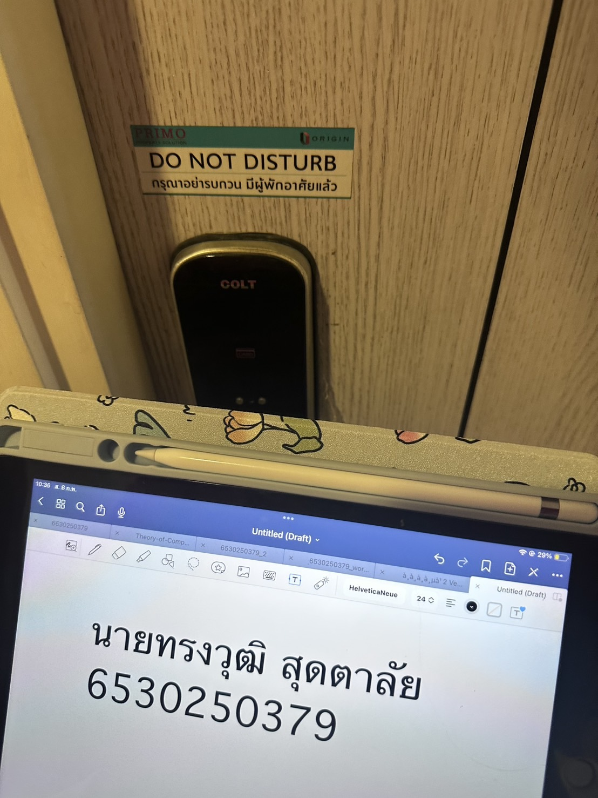

# security-control

ระบบ คีย์การ์ด ( Access Control )
Location : Kensington Laemchabang-Sriracha

 - Types of Security Controls: Physical Controls
 - Control Functions : Preventive Controls

ระบบล็อกประตูด้วยคีย์การ์ดเป็นหนึ่งในมาตรการควบคุมด้านความปลอดภัยประเภท "Physical Controls" ที่มีหน้าที่หลักในการป้องกัน (Preventive Controls) โดยระบบนี้ใช้เทคโนโลยีการตรวจสอบและยืนยันตัวตนผ่านบัตรคีย์การ์ด ซึ่งช่วยให้เฉพาะผู้ที่ได้รับอนุญาตเท่านั้นสามารถเข้าถึงพื้นที่ที่กำหนดได้

#การใช้งานคีย์การ์ดมีข้อดีหลายประการ เช่น

เพิ่มระดับความปลอดภัย: ลดโอกาสในการบุกรุกหรือการเข้า-ออกโดยไม่ได้รับอนุญาต
บันทึกการเข้า-ออก: ระบบสามารถบันทึกเวลาและข้อมูลของผู้ที่ใช้คีย์การ์ดในการเข้าใช้งาน ทำให้สามารถติดตามและตรวจสอบย้อนหลังได้
ลดความเสี่ยงจากการใช้กุญแจแบบดั้งเดิม: กุญแจสามารถสูญหายหรือถูกทำสำเนาได้ง่าย ในขณะที่คีย์การ์ดสามารถตั้งค่าการอนุญาตใหม่หรือลบข้อมูลออกจากระบบได้เมื่อมีการสูญหาย
สะดวกต่อการบริหารจัดการ: สามารถกำหนดสิทธิ์การเข้าถึงตามระดับผู้ใช้งาน เช่น พนักงาน ผู้บริหาร หรือแขกที่ได้รับอนุญาตชั่วคราวระบบล็อกประตูด้วยคีย์การ์ดเป็นหนึ่งในมาตรการควบคุมด้านความปลอดภัยประเภท "Physical Controls" ที่มีหน้าที่หลักในการป้องกัน (Preventive Controls) โดยระบบนี้ใช้เทคโนโลยีการตรวจสอบและยืนยันตัวตนผ่านบัตรคีย์การ์ด ซึ่งช่วยให้เฉพาะผู้ที่ได้รับอนุญาตเท่านั้นสามารถเข้าถึงพื้นที่ที่กำหนดได้

[Back](README.md)
